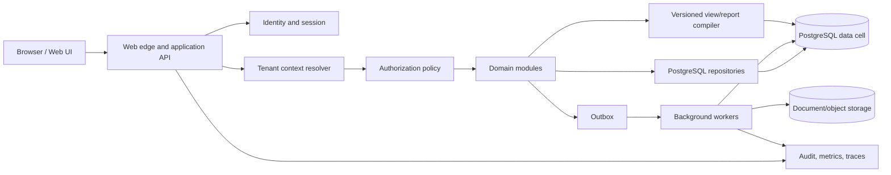

# Target architecture

## Principles

1. Financial correctness and tenant isolation outrank UI velocity.
2. Identity, tenant, company, and accounting-year context are request-scoped,
   immutable after authorization, and visible in every audit event.
3. Business rules live in named domain services and reviewed database
   invariants, not scattered string replacement or UI event handlers.
4. Metadata remains a first-class capability, but it is typed, versioned,
   validated, testable, and deployable.
5. Start with a modular monolith and explicit module boundaries. Split services
   only when ownership, scaling, or reliability evidence justifies it.
6. Long-running reports, imports, exports, migrations, and printing are durable
   background jobs, never request/session-dependent scratch-table sequences.
7. Every read/write path produces traceable evidence for parity, audit, and
   future data products.

## Logical system



The UI never receives database credentials or a schema name. The server derives
an immutable context from the authenticated membership and the selected
company/year, then authorizes the requested action before invoking a domain
module.

## Control plane

The control plane replaces the process-global and `smart_system` routing model:

- tenants and deployment cells;
- companies and accounting years;
- users/identities, memberships, roles, and scoped permission grants;
- company/year access and default selections;
- feature/module entitlements;
- tenant configuration and override versions;
- schema/data migration state;
- document/report template catalog;
- connection target references (never secret values);
- audit retention and data classification policy.

Selection flow:

```text
authenticated identity
  → active tenant memberships
  → permitted companies
  → permitted/open accounting years
  → immutable TenantContext
  → route/action permission
  → transaction-scoped PostgreSQL context
```

Opening a company/year must be idempotent. Legacy version upgrades or data
mutations triggered during selection become explicit, separately authorized
migration jobs.

## Data plane

The target canonical model uses `tenant_id`, `company_id`, and
`accounting_year_id` on business records, with composite uniqueness and foreign
keys that include the tenant boundary. PostgreSQL row-level security is defense
in depth, not a replacement for API authorization.

Use cell-based scaling:

- A cell contains a bounded set of tenants and independent PostgreSQL,
  application worker, backup, and observability capacity.
- The control catalog maps a tenant to exactly one active cell/version.
- Standard tenants share canonical tables inside a cell with RLS.
- A high-volume, regulated, or residency-constrained tenant can receive a
  dedicated cell/database without changing domain contracts.

During migration, a compatibility adapter may route to a legacy
schema/database-per-company-year. That mapping is server-controlled and
temporary. Fiscal years become data dimensions in the target model; creating a
new schema/database every year is not the target.

Partition large ledgers only after measuring data size and query patterns.
Likely candidates are time/fiscal-year ranges within a cell. Partition keys,
primary keys, and uniqueness constraints must be designed together.

## Application modules

Initial module boundaries:

- Identity, session, and access policy.
- Tenant/company/accounting-year context.
- Metadata catalog and compiled UI/query definitions.
- Accounting masters and custom fields.
- Financial entries, posting, allocations, and balances.
- Inventory, products, stock movement, and valuation.
- Tax/GST, e-invoice, and e-way bill integration.
- Reporting, dashboards, analysis, and exports.
- Document templates, print jobs, delivery, and retention.
- Imports/integrations (Excel, Tally, bank, external tax services).
- Audit, outbox, notifications, and operational jobs.
- Migration/reconciliation administration.

Each module owns its commands, queries, invariants, permissions, audit events,
and tests. Direct cross-module table updates are prohibited; use a domain API or
transactional event contract.

`platform/audit/audit-event.ts` supplies the initial immutable audit-event
contract: every event carries the full tenant/company/year context, actor,
resource, correlation ID, outcome, and redacted details. Persistence,
append-only storage, retention, and transactional outbox delivery remain part
of the PostgreSQL platform work.

## Metadata runtime

Preserve the valuable generic behavior of `smart_setup`, but replace raw query
fragments and opaque numeric flags with contracts:

- `screen_definition` and version;
- ordered `field_definition` with type, label, validation, lookup, visibility,
  and write mapping;
- `action_definition` with permission and command/query contract;
- `query_definition` with named parameters and output schema;
- `report_definition` and template version;
- tenant/company/year overrides with precedence and effective dates;
- compiler status, contract hash, deployment, rollback, and audit records.

Custom fields use a separate typed definition contract. A field belongs to one
canonical entity—not a legacy polymorphic row—and declares value type,
type-specific constraints, allowed product surfaces, scope, permissions, and
audit event. Sparse values may be stored during transition, but any field used
for joins, uniqueness, range filters, financial rules, or high-volume reports
must receive an explicit typed/indexed projection after review.

Definitions progress through draft, validated, approved, active, and retired.
The compiler accepts only supported operators, catalog-owned identifiers, and
bound values. It emits a deterministic contract that can be diffed and tested.

## Printing and reports

Replace shared blank-after-print tables with job-scoped records:

```text
print_job
  id, tenant/company/year, requested_by, idempotency_key, status,
  document_type, template_version, renderer_version, created/expires timestamps

print_snapshot
  job_id, immutable header/body/footer payload or normalized rows, source hash

print_artifact
  job_id, object key, media type, checksum, delivery/audit status
```

Workers claim jobs atomically. Retries are idempotent. Generated artifacts are
tenant-scoped, encrypted, access-controlled, checksummed, and retained by
policy. Golden PDF/image comparisons replace assumptions about Crystal output.

The current source-independent job contract in `platform/jobs/job-state.ts`
models the allowed queued/claimed/succeeded/failed/cancelled transitions,
bounded retries, claiming-worker ownership, tenant-scoped idempotency keys, and
auditable lifecycle events. It does not yet persist jobs, lease them atomically
in PostgreSQL, render documents, or deliver artifacts.

Reports use typed parameters and output contracts. Expensive reports run as
jobs or against reviewed read models/replicas. Cache keys always include tenant,
company, accounting year, permission-relevant scope, definition version, and
parameters.

## Reliability and scale

- Stateless web processes; horizontal scale without sticky database sessions.
- Bounded connection pools per cell and workload class.
- Idempotency keys and optimistic concurrency/version columns for mutable
  commands.
- Transactional outbox for reliable jobs/events; no dual writes.
- Cursor/keyset pagination for large ledgers and audit streams.
- Tenant-aware quotas, rate limits, timeouts, and report cost limits.
- Structured logs, metrics, distributed traces, query fingerprints, and audit
  events with tenant-safe redaction.
- Point-in-time recovery, encrypted backups, tested restores, and declared
  RPO/RTO per cell.
- Zero-downtime-compatible expand/migrate/contract schema changes.

## Deployment stages

1. Development with synthetic PostgreSQL data.
2. CI disposable PostgreSQL and browser tests.
3. Integration with sanitized metadata and golden fixtures.
4. Isolated parity environment connected to restored copies.
5. Pilot cell/tenant with monitored canary routing.
6. Production cells with progressive tenant/year cutover.

No production deployment is allowed until real authentication, server-side
authorization, isolation tests, backup/restore evidence, and a signed pilot
reconciliation exist.
